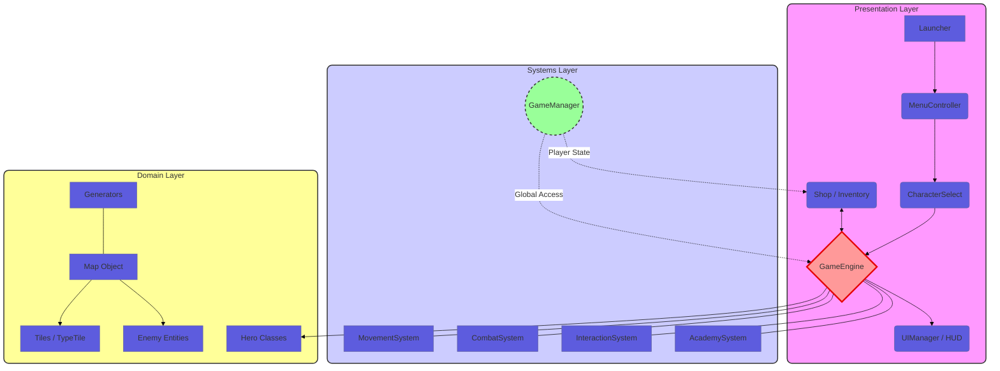

# JavaFX RPG Project
A 2D Role-Playing Game engine built with JavaFX, featuring procedural generation and a dedicated systems-driven architecture.

## Architecture Overview
The project follows a **Modified MVC** pattern with a centralized **Orchestrator** to manage game states and interactions.

